Our progress timeline
=================
## Implement Mapbox map engine in our website
# 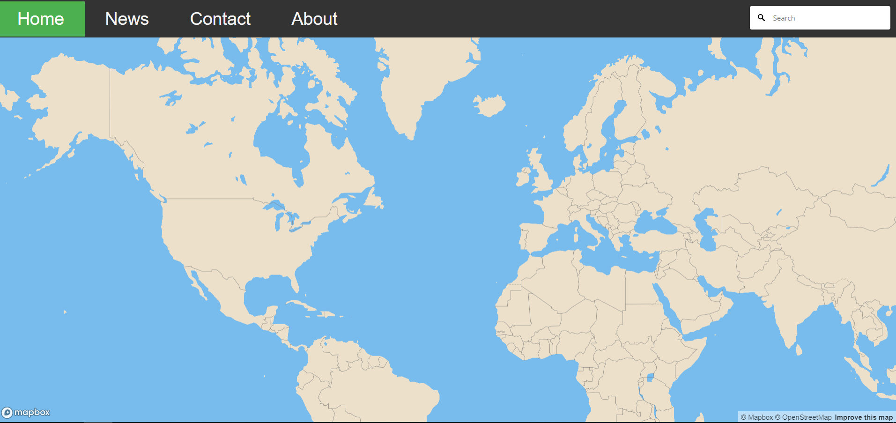
## Design a user interface and a side bar for data display purposes
# 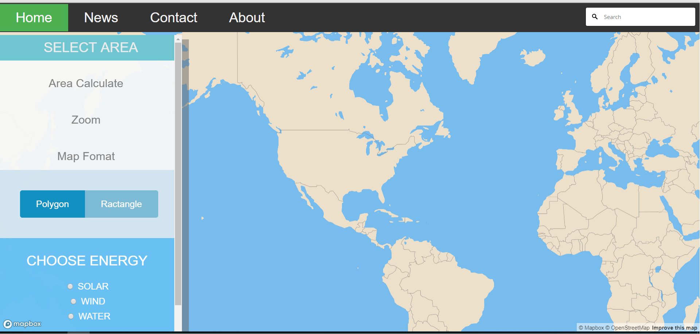
## Use data in point form to try to generate heat map (abandon)
# 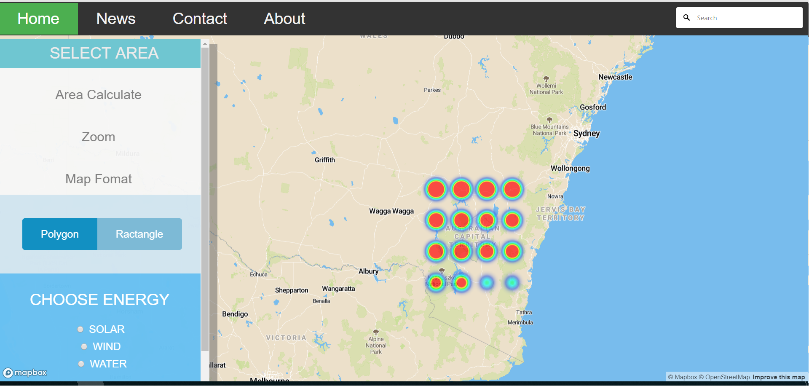
## Realize Arcgis is better in terms of data analysis and explore on it
# 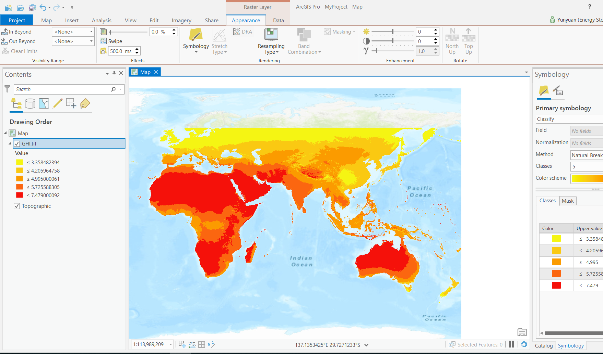
## Implement Arcgis map engine in our website
# 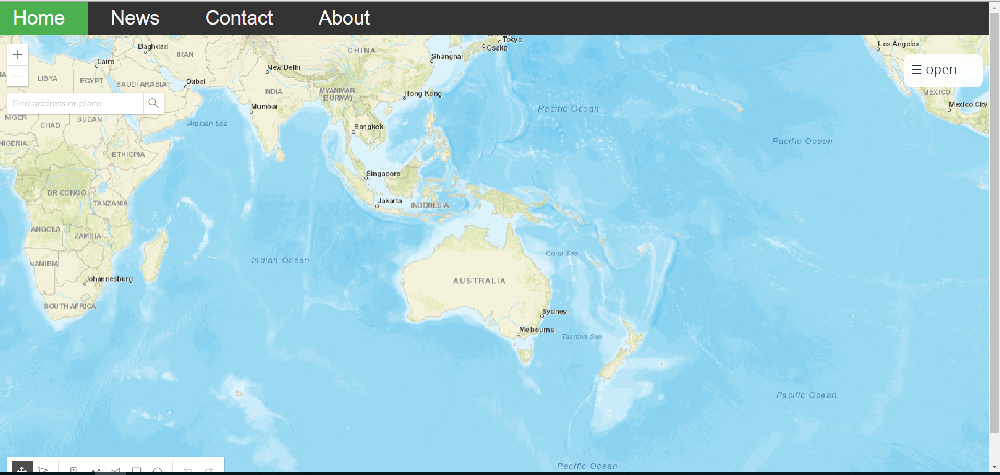
## Visualize mutiple data in our website
# 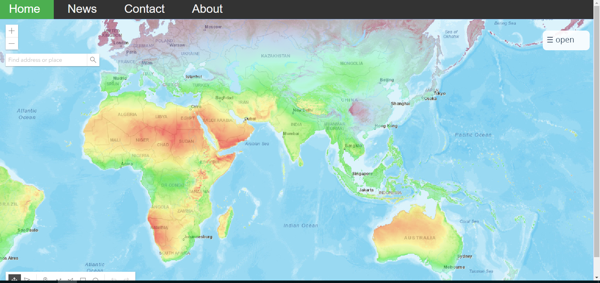
## Create a widget that allow to draw polygon in our map
# 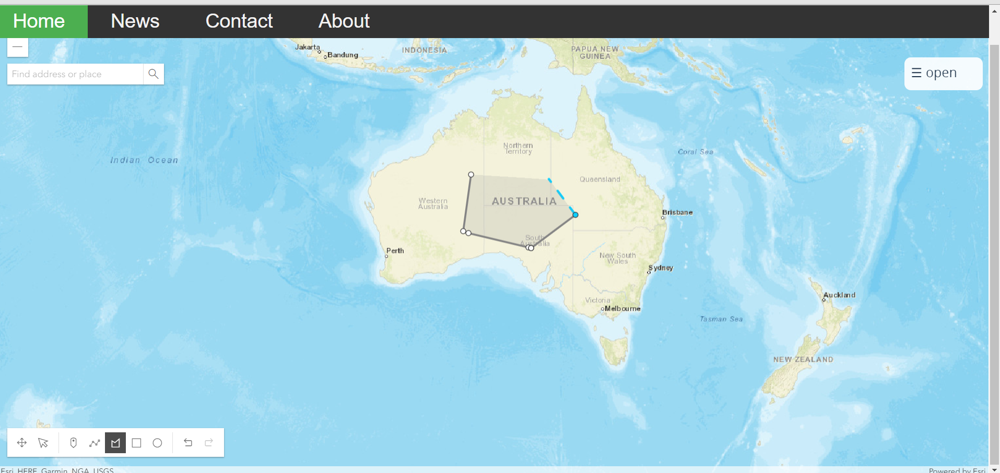
## Explore on the algorithm on sample data
# 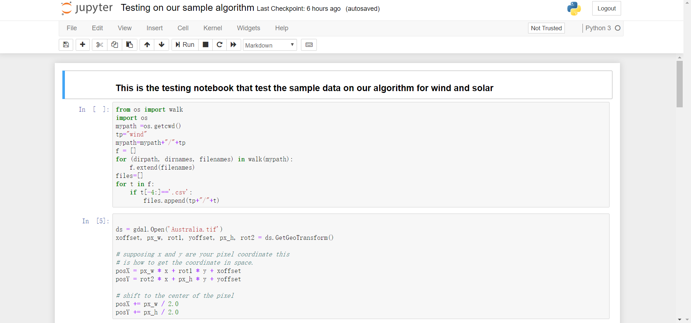
## Doing research on algorithm of "General to specific or specific to general"
# 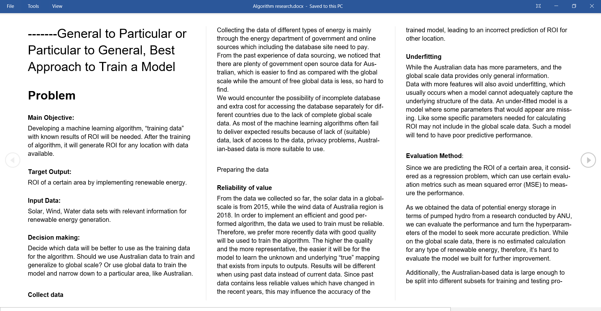
## Extracting data from files through python
# 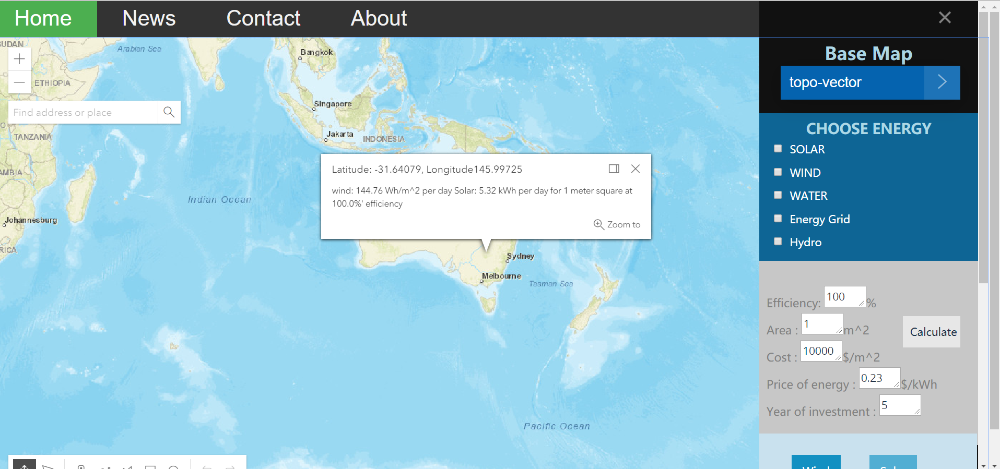
## Perform and apply various algorithm on the calculation
# 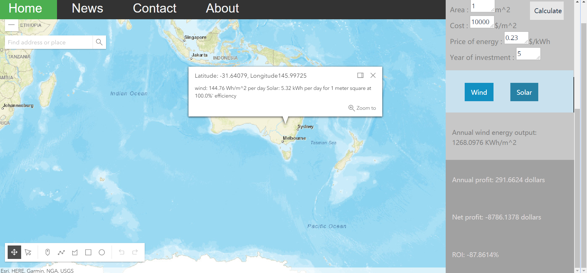
