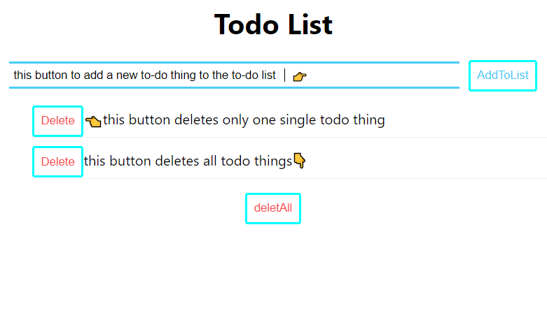

## *This is a seperate application that required by our client. It is not related to our project.

# Technical Report
There are some reasons to use React which is a javascript library to help create interactive UIs.
The first and foremost, it is easy to separate the whole app into different components. 
In other words, each individual parts can be easy to develop, test and maintain. 
The todo list app is the first time to create an app with React, which helps the frontend team quickly familiar with this way.
Each task can be submitted and deleted individually. 
# 
# Implement
In this todo-list app, it has a main file (App.hs) to combine all the components and show them on the webpage. 
The object contains an index called id and the text contents.
And there are three components: Header.js, todoInput.js and todoItem.js. 
The Header.js shows the main title. And most of the methods and submit button are created in todoInput.js. 
And the remove button is divided into the todoItem part. 
Parameter passing enables information sharing in different components, so the main todo list object can be changed by each separated parts. 
